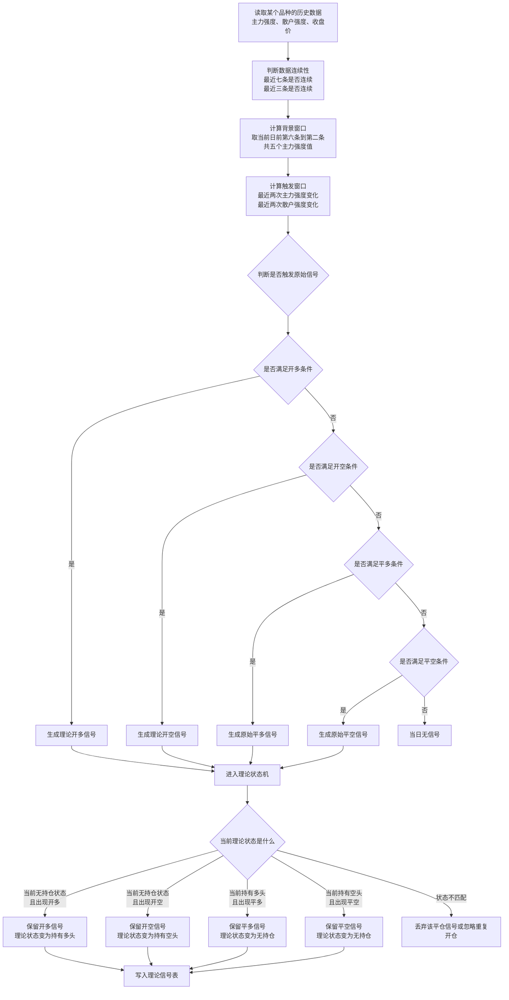
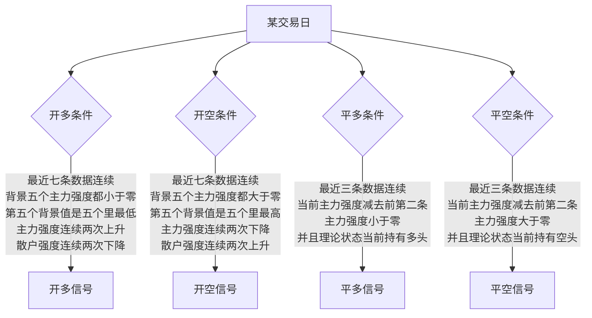
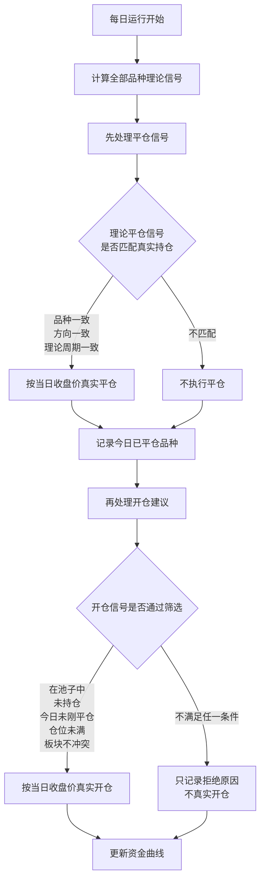

# 策略信号流程图

本文档说明当前策略中四类信号的生成和执行流程：

- 开多信号
- 开空信号
- 平多信号
- 平空信号

## 一、理论信号生成总流程

## 二、四类信号判断条件

## 三、真实交易执行流程

理论信号不等于真实交易。系统每天先计算全品种理论信号，然后先处理平仓，再处理开仓。

## 四、关键规则说明

### 开多信号

开多信号要求最近七条数据连续，背景窗口里的五个主力强度值全部小于零，并且第五个背景值是五个值中最低的一个。同时，最近两次主力强度变化都要向上，最近两次散户强度变化都要向下。

这表示：主力强度先处在负值区域并形成低点，然后主力开始连续回升，而散户连续走弱。

### 开空信号

开空信号要求最近七条数据连续，背景窗口里的五个主力强度值全部大于零，并且第五个背景值是五个值中最高的一个。同时，最近两次主力强度变化都要向下，最近两次散户强度变化都要向上。

这表示：主力强度先处在正值区域并形成高点，然后主力开始连续回落，而散户连续走强。

### 平多信号

平多信号要求最近三条数据连续，并且当前主力强度减去前第二条主力强度小于零。

不过，原始平多条件成立后，还必须经过理论状态机过滤：只有当前理论状态已经持有多头时，平多信号才会被保留。

### 平空信号

平空信号要求最近三条数据连续，并且当前主力强度减去前第二条主力强度大于零。

不过，原始平空条件成立后，也必须经过理论状态机过滤：只有当前理论状态已经持有空头时，平空信号才会被保留。

## 五、一句话总结

系统先用主力强度和散户强度生成理论上的开多、开空、平多、平空信号；再用理论状态机过滤不合理的平仓；最后真实交易只执行和当前真实持仓、仓位限制、池子配置都匹配的信号。
